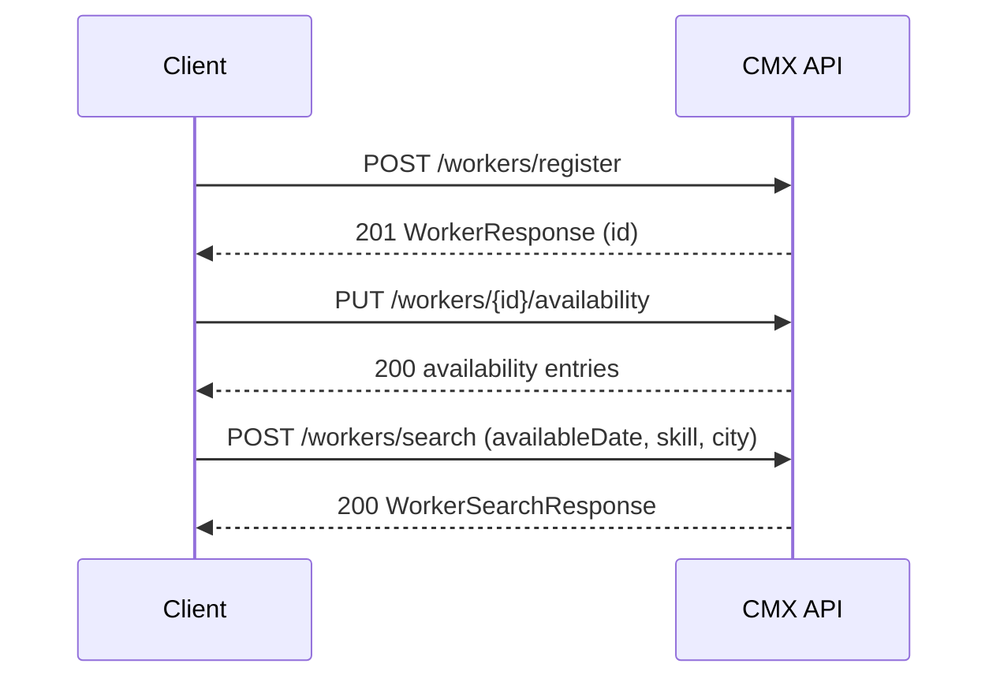

# CMX Worker Management — API Reference

**Base URL:** `http://localhost:8080`  
**API prefix:** `/api/v1`  
**Content type:** `application/json` (all request/response bodies)

---

## Table of contents

1. [Overview](#overview)
2. [Common headers](#common-headers)
3. [Error responses](#error-responses)
4. [Shared schemas](#shared-schemas)
5. [Endpoints](#endpoints)
   - [Health check](#1-health-check)
   - [Register worker](#2-register-worker)
   - [Get worker by ID](#3-get-worker-by-id)
   - [Search workers](#4-search-workers)
   - [Submit rating](#5-submit-rating)
   - [Update availability](#6-update-availability)
   - [Get availability](#7-get-availability)

---

## Overview

The CMX Worker Management API lets clients register workers, search for them, submit ratings, and manage per-date availability. All persisted translatable fields (city, skills, address, etc.) are stored in **English** in Excel; responses can be localized via headers.

| Method | Path | Description |
|--------|------|-------------|
| `GET` | `/api/v1/health` | Service health |
| `POST` | `/api/v1/workers/register` | Register a new worker |
| `GET` | `/api/v1/workers/{id}` | Get full worker profile |
| `POST` | `/api/v1/workers/search` | Search workers with optional filters |
| `POST` | `/api/v1/workers/ratings` | Submit a rating for a worker |
| `PUT` | `/api/v1/workers/{id}/availability` | Set/update availability for date(s) |
| `GET` | `/api/v1/workers/{id}/availability` | List availability entries |

**Authentication:** None (v1 — open endpoints).

---

## Common headers

| Header | Used on | Default | Description |
|--------|---------|---------|-------------|
| `Content-Type` | All POST/PUT | — | Must be `application/json` |
| `Content-Language` | Register, Search | `en` | Locale of **request body** text (e.g. `hi`). Translatable fields are converted to English before storage/filtering. |
| `Accept-Language` | Register, Get worker, Search | `en` | Locale for **response** translatable fields (e.g. `hi`, `ta`). |
| `X-Correlation-Id` | All (optional) | auto-generated | Client-supplied request ID; echoed in logs and error responses. |

**Locale format:** BCP-47 language tags (e.g. `en`, `hi`, `ta`). English (`en`) skips translation.

---

## Error responses

All errors return the same JSON shape:

```json
{
  "code": "VALIDATION_ERROR",
  "message": "Validation failed",
  "correlationId": "a1b2c3d4-e5f6-7890-abcd-ef1234567890",
  "timestamp": "2026-06-13T10:30:00Z",
  "fieldErrors": [
    {
      "field": "basicInfo.mobileNumber",
      "message": "Invalid mobile number"
    }
  ]
}
```

| HTTP | Code | When |
|------|------|------|
| `400` | `VALIDATION_ERROR` | Bean Validation failed on request body |
| `400` | `INVALID_RATING` | Rating score out of range |
| `404` | `WORKER_NOT_FOUND` | Worker ID, phone, or name not found |
| `409` | `DUPLICATE_WORKER` | Mobile number or email already registered |
| `409` | `AMBIGUOUS_WORKER` | Multiple workers match the given name (use phone instead) |
| `503` | `TRANSLATION_UNAVAILABLE` | Cloud translation provider failed (write path) |
| `500` | `STORAGE_ERROR` | Excel/storage operation failed |
| `500` | `INTERNAL_ERROR` | Unexpected server error |

---

## Shared schemas

### Enums

| Enum | Values |
|------|--------|
| `Gender` | `MALE`, `FEMALE`, `OTHER` |
| `AvailabilityStatus` | `AVAILABLE`, `UNAVAILABLE`, `ON_ASSIGNMENT` |
| `SkillLevel` | `BEGINNER`, `INTERMEDIATE`, `EXPERT` |
| `WorkType` | `FULL_TIME`, `PART_TIME`, `CONTRACT` |

### WorkerBasicInfo (request — registration)

| Field | Type | Required | Constraints |
|-------|------|----------|-------------|
| `fullName` | string | yes | non-blank |
| `mobileNumber` | string | yes | `+` optional; 10–15 digits |
| `email` | string | yes | valid email |
| `profilePhotoUrl` | string | no | URL |
| `dateOfBirth` | date (ISO) | yes | must be in the past |
| `gender` | `Gender` | yes | |
| `city` | string | yes | translatable |
| `state` | string | yes | translatable |
| `address` | string | yes | translatable |
| `pincode` | string | yes | exactly 6 digits |
| `latitude` | decimal | no | |
| `longitude` | decimal | no | |
| `primaryLanguage` | string | yes | e.g. `hi`, `en` |
| `availabilityStatus` | `AvailabilityStatus` | yes | profile-level status (not per-date) |

### WorkerSkills (request — registration)

| Field | Type | Required | Constraints |
|-------|------|----------|-------------|
| `primarySkill` | string | yes | translatable |
| `secondarySkills` | string[] | no | translatable |
| `experienceYears` | decimal | yes | ≥ 0 |
| `skillLevel` | `SkillLevel` | yes | |
| `certifications` | string[] | no | translatable |
| `toolsOwned` | string[] | no | translatable |
| `workType` | `WorkType` | yes | |
| `languagesSpoken` | string[] | no | language codes, not translated |
| `portfolioImages` | string[] | no | URLs, not translated |

### WorkerResponse (full profile)

Returned by **Register** and **Get worker**. Combines basic info + skills.

| Field | Type | Notes |
|-------|------|-------|
| `id` | string (UUID) | |
| `fullName` | string | not translated |
| `mobileNumber` | string | not translated |
| `email` | string | not translated |
| `profilePhotoUrl` | string | |
| `dateOfBirth` | date | ISO `YYYY-MM-DD` |
| `age` | integer | computed from DOB |
| `gender` | `Gender` | |
| `city` | string | localized per `Accept-Language` |
| `state` | string | localized |
| `address` | string | localized |
| `pincode` | string | |
| `latitude` | decimal | |
| `longitude` | decimal | |
| `primaryLanguage` | string | |
| `availabilityStatus` | `AvailabilityStatus` | |
| `createdAt` | datetime (ISO-8601) | |
| `updatedAt` | datetime (ISO-8601) | |
| `primarySkill` | string | localized |
| `secondarySkills` | string[] | localized |
| `experienceYears` | decimal | |
| `skillLevel` | `SkillLevel` | |
| `certifications` | string[] | localized |
| `toolsOwned` | string[] | localized |
| `workType` | `WorkType` | |
| `languagesSpoken` | string[] | |
| `portfolioImages` | string[] | |

---

## Endpoints

### 1. Health check

```
GET /api/v1/health
```

**Response `200 OK`**

```json
{
  "status": "UP"
}
```

---

### 2. Register worker

```
POST /api/v1/workers/register
```

Creates a worker record in basic-info and skills workbooks. Returns the full profile.

**Headers**

| Header | Example |
|--------|---------|
| `Content-Language` | `hi` — input city/skills translated to English before save |
| `Accept-Language` | `hi` — response fields localized to Hindi |

**Request body**

```json
{
  "basicInfo": {
    "fullName": "Rajesh Kumar",
    "mobileNumber": "+919876543210",
    "email": "rajesh@example.com",
    "profilePhotoUrl": null,
    "dateOfBirth": "1990-05-15",
    "gender": "MALE",
    "city": "Chennai",
    "state": "Tamil Nadu",
    "address": "12 MG Road",
    "pincode": "600001",
    "latitude": null,
    "longitude": null,
    "primaryLanguage": "hi",
    "availabilityStatus": "AVAILABLE"
  },
  "skills": {
    "primarySkill": "Welding",
    "secondarySkills": ["Painting"],
    "experienceYears": 5.5,
    "skillLevel": "INTERMEDIATE",
    "certifications": ["ITI Welding"],
    "toolsOwned": ["Arc welder"],
    "workType": "FULL_TIME",
    "languagesSpoken": ["hi", "en"],
    "portfolioImages": []
  }
}
```

| Field | Type | Required |
|-------|------|----------|
| `basicInfo` | `WorkerBasicInfo` | yes |
| `skills` | `WorkerSkills` | yes |

**Response `201 Created`**

Body: [`WorkerResponse`](#workerresponse-full-profile)

`Location` header: `/api/v1/workers/{id}`

**Example**

```bash
curl -X POST http://localhost:8080/api/v1/workers/register \
  -H "Content-Type: application/json" \
  -H "Content-Language: hi" \
  -H "Accept-Language: hi" \
  -d @register-payload.json
```

**Errors**

| Status | Cause |
|--------|-------|
| `400` | Validation failure (missing fields, invalid phone/pincode) |
| `409` | Duplicate mobile number or email |
| `503` | Translation failed on write (when cloud provider enabled) |

---

### 3. Get worker by ID

```
GET /api/v1/workers/{id}
```

**Path parameters**

| Name | Type | Description |
|------|------|-------------|
| `id` | UUID string | Worker ID from registration |

**Headers**

| Header | Example |
|--------|---------|
| `Accept-Language` | `hi` — localize city, skills, address in response |

**Response `200 OK`**

Body: [`WorkerResponse`](#workerresponse-full-profile)

**Example**

```bash
curl http://localhost:8080/api/v1/workers/550e8400-e29b-41d4-a716-446655440000 \
  -H "Accept-Language: en"
```

**Errors**

| Status | Cause |
|--------|-------|
| `404` | Worker not found |

---

### 4. Search workers

```
POST /api/v1/workers/search
```

Returns a **summary list** (not full profile). All filter fields are optional — **`null` or omitted = ignore that filter**. Non-null filters combine with **AND** logic.

**Headers**

| Header | Purpose |
|--------|---------|
| `Content-Language` | Translate `city` and `skill` in request body to English before matching |
| `Accept-Language` | Localize `city` in each result item |

**Request body — `WorkerSearchRequest`**

| Field | Type | Default | Description |
|-------|------|---------|-------------|
| `city` | string | null | Exact match on English canonical city |
| `skill` | string | null | Match primary or secondary skill (case-insensitive) |
| `minAge` | integer | null | Inclusive; computed from date of birth |
| `maxAge` | integer | null | Inclusive |
| `minExperience` | decimal | null | Inclusive; from skills |
| `maxExperience` | decimal | null | Inclusive |
| `minRating` | decimal | null | Inclusive; average rating 1–5 |
| `availableDate` | date (ISO) | null | Only workers marked `available: true` on this date |
| `page` | integer | `0` | Zero-based page index |
| `size` | integer | `20` | Page size (max `100`) |

```json
{
  "city": "Chennai",
  "skill": "Welding",
  "minAge": null,
  "maxAge": null,
  "minExperience": 3,
  "maxExperience": null,
  "minRating": 4.0,
  "availableDate": "2026-06-15",
  "page": 0,
  "size": 20
}
```

Empty body `{}` returns **all workers** (paginated).

**Response `200 OK` — `WorkerSearchResponse`**

```json
{
  "items": [
    {
      "id": "550e8400-e29b-41d4-a716-446655440000",
      "fullName": "Rajesh Kumar",
      "email": "rajesh@example.com",
      "mobileNumber": "+919876543210",
      "city": "Chennai",
      "experienceYears": 5.5,
      "averageRating": 4.0,
      "ratingCount": 3
    }
  ],
  "total": 1,
  "page": 0,
  "size": 20
}
```

| Field | Type | Description |
|-------|------|-------------|
| `items` | `WorkerSearchResult[]` | Page of results |
| `total` | integer | Total matches before pagination |
| `page` | integer | Current page |
| `size` | integer | Page size used |

**`WorkerSearchResult` item**

| Field | Type |
|-------|------|
| `id` | string (UUID) |
| `fullName` | string |
| `email` | string |
| `mobileNumber` | string |
| `city` | string (localized) |
| `experienceYears` | decimal |
| `averageRating` | decimal (0.0 if no ratings) |
| `ratingCount` | integer |

**Availability filter note:** If `availableDate` is set, workers **without** an explicit `available: true` entry for that date are excluded.

**Example**

```bash
curl -X POST http://localhost:8080/api/v1/workers/search \
  -H "Content-Type: application/json" \
  -H "Accept-Language: hi" \
  -d '{
    "city": "Chennai",
    "skill": "Welding",
    "minExperience": 3,
    "availableDate": "2026-06-15"
  }'
```

---

### 5. Submit rating

```
POST /api/v1/workers/ratings
```

Submit a 1–5 star rating for a worker identified by **phone** or **full name** (exactly one required).

**Request body — `WorkerRatingRequest`**

| Field | Type | Required | Constraints |
|-------|------|----------|-------------|
| `workerPhone` | string | one of phone/name | Unique; preferred identifier |
| `workerName` | string | one of phone/name | Case-insensitive exact match; 409 if ambiguous |
| `score` | integer | yes | 1–5 |
| `reviewerName` | string | no | max 200 chars |
| `comment` | string | no | max 500 chars |

```json
{
  "workerPhone": "+919876543210",
  "workerName": null,
  "score": 4,
  "reviewerName": "ABC Contractors",
  "comment": "Good work on site"
}
```

**Response `201 Created` — `WorkerRatingResponse`**

```json
{
  "workerId": "550e8400-e29b-41d4-a716-446655440000",
  "workerName": "Rajesh Kumar",
  "averageRating": 4.0,
  "ratingCount": 1,
  "submittedScore": 4
}
```

| Field | Type | Description |
|-------|------|-------------|
| `workerId` | string | Rated worker's UUID |
| `workerName` | string | Worker's full name |
| `averageRating` | decimal | Updated average (all ratings) |
| `ratingCount` | integer | Total ratings after submit |
| `submittedScore` | integer | Score just submitted |

**Example**

```bash
curl -X POST http://localhost:8080/api/v1/workers/ratings \
  -H "Content-Type: application/json" \
  -d '{
    "workerPhone": "+919876543210",
    "score": 4,
    "reviewerName": "ABC Contractors"
  }'
```

**Errors**

| Status | Cause |
|--------|-------|
| `400` | Missing both identifiers, or both provided, or invalid score |
| `404` | No worker for phone/name |
| `409` | Multiple workers match the name |

---

### 6. Update availability

```
PUT /api/v1/workers/{id}/availability
```

Upsert one or more date entries. Submitting the same date again **updates** the existing row.

**Path parameters**

| Name | Type |
|------|------|
| `id` | UUID string |

**Request body — `WorkerAvailabilityUpdateRequest`**

```json
{
  "entries": [
    { "date": "2026-06-15", "available": true },
    { "date": "2026-06-16", "available": false }
  ]
}
```

| Field | Type | Required |
|-------|------|----------|
| `entries` | array | yes (non-empty) |
| `entries[].date` | date (ISO) | yes |
| `entries[].available` | boolean | yes |

**Response `200 OK` — `WorkerAvailabilityResponse`**

```json
{
  "workerId": "550e8400-e29b-41d4-a716-446655440000",
  "entries": [
    {
      "date": "2026-06-15",
      "available": true,
      "updatedAt": "2026-06-13T14:30:00Z"
    },
    {
      "date": "2026-06-16",
      "available": false,
      "updatedAt": "2026-06-13T14:30:00Z"
    }
  ]
}
```

**Example**

```bash
curl -X PUT http://localhost:8080/api/v1/workers/550e8400-e29b-41d4-a716-446655440000/availability \
  -H "Content-Type: application/json" \
  -d '{
    "entries": [
      { "date": "2026-06-15", "available": true }
    ]
  }'
```

**Errors**

| Status | Cause |
|--------|-------|
| `400` | Empty entries or missing date/available |
| `404` | Worker not found |

---

### 7. Get availability

```
GET /api/v1/workers/{id}/availability?from={date}&to={date}
```

**Path parameters**

| Name | Type |
|------|------|
| `id` | UUID string |

**Query parameters (optional)**

| Name | Type | Description |
|------|------|-------------|
| `from` | date (ISO) | Inclusive start of range |
| `to` | date (ISO) | Inclusive end of range |

Omit both to return all stored entries for the worker.

**Response `200 OK`**

Same schema as [Update availability response](#6-update-availability): `WorkerAvailabilityResponse`

**Example**

```bash
curl "http://localhost:8080/api/v1/workers/550e8400-e29b-41d4-a716-446655440000/availability?from=2026-06-01&to=2026-06-30"
```

**Errors**

| Status | Cause |
|--------|-------|
| `404` | Worker not found |

---

## Typical flows

### Register → set availability → search



### Rate a worker after job

1. `POST /workers/ratings` with `workerPhone` and `score`
2. `POST /workers/search` with `minRating` to find highly rated workers

---

## Data storage note

Worker data is persisted to Excel workbooks under `./data/` (configurable):

| Workbook | Content |
|----------|---------|
| `workers_basic_info.xlsx` | Profile fields |
| `workers_skills.xlsx` | Skills linked by `user_id` |
| `workers_ratings.xlsx` | Rating rows |
| `workers_availability.xlsx` | Per-date availability |

All translatable text is stored in **English** regardless of `Content-Language` on input.
