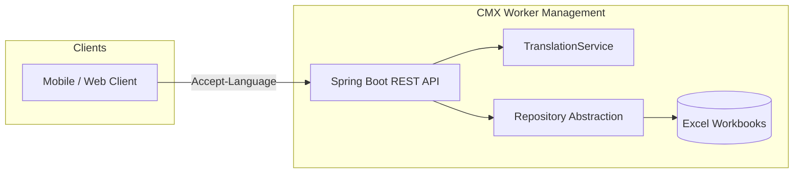
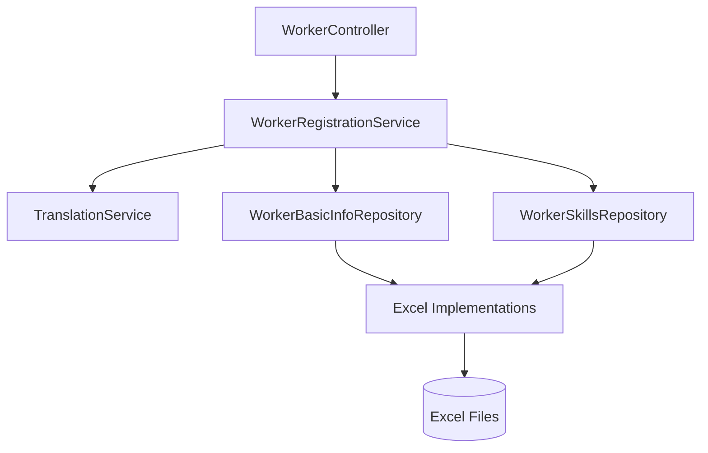
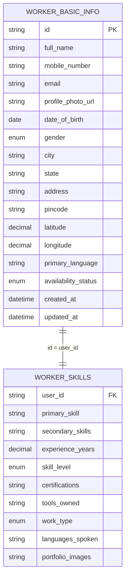

# Architecture — CMX Labour Registration

## System Context



Workers register via a REST API. The service translates input to English before persistence and translates output to the client’s preferred language on read. Storage is Excel in v0.1, hidden behind repository interfaces so a SQL backend can be dropped in later.

## Technology Stack

| Layer | Choice | Notes |
|-------|--------|-------|
| Runtime | **Java 17** | Required |
| Framework | **Spring Boot 3.4.x** | Web, Validation, Actuator; Java 17 compatible |
| API | Spring Web MVC + Springdoc OpenAPI | REST, JSON |
| Storage (v0.1) | Apache POI | Read/write `.xlsx` workbooks |
| Storage (future) | Spring Data JPA + PostgreSQL | Same repository interfaces |
| i18n | Spring `MessageSource` + `TranslationService` | Static labels + dynamic field translation |
| Logging | SLF4J / Logback | Centralized via filter + `@RestControllerAdvice` |
| Build | Maven | `cmx/` module |
| Security | None (v0.1) | Spring Security omitted until required |

## Module Layout

```
CMX_worker_management/
├── docs/
├── data/                                    # Excel files (gitignored in prod)
│   ├── workers_basic_info.xlsx
│   └── workers_skills.xlsx
├── cmx/
│   ├── pom.xml
│   └── src/main/java/com/cmx/workermanagemnt/cmx/
│       ├── CmxApplication.java
│       ├── config/                          # OpenAPI, Locale, storage properties
│       ├── domain/                          # Plain POJOs (not JPA entities)
│       │   ├── WorkerBasicInfo.java
│       │   └── WorkerSkills.java
│       ├── repository/                      # Abstraction layer
│       │   ├── WorkerBasicInfoRepository.java
│       │   ├── WorkerSkillsRepository.java
│       │   └── excel/
│       │       ├── ExcelWorkerBasicInfoRepository.java
│       │       ├── ExcelWorkerSkillsRepository.java
│       │       └── ExcelFileSupport.java    # POI helpers, row mapping
│       ├── service/
│       │   ├── WorkerRegistrationService.java
│       │   └── TranslationService.java
│       ├── web/
│       │   ├── WorkerController.java
│       │   ├── dto/                         # Request/response DTOs
│       │   └── mapper/                      # DTO ↔ domain mappers
│       ├── exception/
│       │   ├── GlobalExceptionHandler.java  # Single exception handler
│       │   ├── ErrorResponse.java
│       │   └── Domain exceptions
│       └── logging/
│           ├── RequestLoggingFilter.java
│           └── CorrelationIdFilter.java
│   └── src/main/resources/
│       ├── application.properties
│       ├── i18n/
│       │   ├── messages_en.properties
│       │   ├── messages_hi.properties
│       │   └── messages_ta.properties       # extend as needed
│       └── translations/                    # Dynamic field translations (en ↔ locale)
│           └── skills_en_hi.properties
└── README.md
```

## Layered Design



| Layer | Responsibility |
|-------|----------------|
| **Controller** | HTTP mapping, `@Valid` input, locale resolution, DTO mapping. No business rules. |
| **Service** | Registration orchestration, duplicate checks, age computation, translate-on-read/write coordination. |
| **Repository (interface)** | Persistence contract; unaware of Excel vs SQL. |
| **Repository (excel)** | Apache POI row read/write, file init, delimiter parsing. |
| **TranslationService** | Input normalization to English; output localization. |
| **GlobalExceptionHandler** | Maps all exceptions to `ErrorResponse` JSON. |
| **Logging filters** | Correlation ID, request/response metadata, error logging. |

## Repository Abstraction

The service layer depends only on interfaces. Excel is one implementation; SQL replaces it later.

```java
public interface WorkerBasicInfoRepository {
    WorkerBasicInfo save(WorkerBasicInfo info);
    Optional<WorkerBasicInfo> findById(String id);
    boolean existsByMobileNumber(String mobileNumber);
    boolean existsByEmail(String email);
}

public interface WorkerSkillsRepository {
    WorkerSkills save(WorkerSkills skills);
    Optional<WorkerSkills> findByUserId(String userId);
}
```

**Spring wiring (v0.1):**

```properties
cmx.storage.type=excel
cmx.storage.excel.base-path=./data
cmx.storage.excel.basic-info-file=workers_basic_info.xlsx
cmx.storage.excel.skills-file=workers_skills.xlsx
```

**Future SQL wiring:**

```properties
cmx.storage.type=sql
# spring.datasource.* as usual
```

Use `@ConditionalOnProperty(name = "cmx.storage.type", havingValue = "excel")` on Excel repos and `havingValue = "sql"` on JPA repos. Only one active at a time.

## Excel Storage Design

### File Structure

Each workbook has a **header row** (row 0) matching field names exactly, followed by data rows.

**`workers_basic_info.xlsx`**

```
id | full_name | mobile_number | email | profile_photo_url | date_of_birth | gender | city | state | address | pincode | latitude | longitude | primary_language | availability_status | created_at | updated_at
```

**`workers_skills.xlsx`**

```
user_id | primary_skill | secondary_skills | experience_years | skill_level | certifications | tools_owned | work_type | languages_spoken | portfolio_images
```

### List Field Encoding

Multi-value fields are stored as pipe-separated strings:

```
Welding|Painting|Plumbing
```

`ExcelFileSupport` handles split/join with empty-list → blank cell.

### File Lifecycle

1. On application startup, `ExcelFileSupport` ensures files exist (creates with headers if missing).
2. **Create:** append row at next empty row.
3. **Read by id:** scan rows (acceptable for v0.1 volume); index in memory optional optimization.
4. **Concurrency:** synchronize writes on file monitor; document single-instance limitation.

### Migration Path to SQL

When SQL is introduced:

1. Add JPA entities mirroring the same fields.
2. Implement `WorkerBasicInfoRepository` / `WorkerSkillsRepository` with Spring Data JPA.
3. Provide a one-off migration script to import Excel rows into tables.
4. Flip `cmx.storage.type=sql`.
5. No changes to `WorkerRegistrationService`, controller, or DTOs.

## Domain Model



`age` is **not stored**; computed in the service: `Period.between(dateOfBirth, LocalDate.now()).getYears()`.

## Multi-Language Architecture

### Locale Resolution (read)

Priority order:

1. `Accept-Language` request header
2. Worker’s `primary_language` (for GET by id)
3. Default `en`

### Write Path (register)

1. Client may send `Content-Language: hi` with Hindi field values.
2. `TranslationService.toEnglish(dto, sourceLocale)` converts translatable fields to English.
3. English values persisted to Excel.
4. Response messages localized via `MessageSource`.

### Read Path (get)

1. Load English record from Excel.
2. `TranslationService.fromEnglish(domain, targetLocale)` localizes translatable fields.
3. Enum codes mapped to localized labels via `messages_{locale}.properties` keys like `gender.MALE=पुरुष`.

### TranslationService Contract

```java
public interface TranslationService {
    WorkerRegistrationRequest toEnglish(WorkerRegistrationRequest request, Locale source);
    WorkerResponse fromEnglish(WorkerBasicInfo basic, WorkerSkills skills, Locale target);
}
```

**v0.1 implementation:** property-file dictionaries for skills, cities, and enums; passthrough for proper nouns and URLs.

**Google Cloud Translation (Phase 6):** set `cmx.translation.provider=google` or `composite` with `cmx.translation.google.api-key`. English remains canonical in Excel; Google translates translatable fields on write (`Content-Language` → en) and read (`Accept-Language` ← en). `composite` uses bundled property files for known vocabulary and Google for unknown free text. Results are cached in memory (Caffeine) to reduce API cost.

## API Design

Base path: `/api/v1`

### POST `/workers/register`

**Headers:** `Content-Language` (optional, default `en`)

**Request body:**

```json
{
  "basicInfo": {
    "fullName": "Rajesh Kumar",
    "mobileNumber": "+919876543210",
    "email": "rajesh@example.com",
    "profilePhotoUrl": "https://cdn.example/photo.jpg",
    "dateOfBirth": "1990-05-15",
    "gender": "MALE",
    "city": "Chennai",
    "state": "Tamil Nadu",
    "address": "12 MG Road",
    "pincode": "600001",
    "latitude": 13.0827,
    "longitude": 80.2707,
    "primaryLanguage": "hi",
    "availabilityStatus": "AVAILABLE"
  },
  "skills": {
    "primarySkill": "Welding",
    "secondarySkills": ["Painting", "Plumbing"],
    "experienceYears": 5.5,
    "skillLevel": "INTERMEDIATE",
    "certifications": ["ITI Welding"],
    "toolsOwned": ["Arc welder", "Helmet"],
    "workType": "FULL_TIME",
    "languagesSpoken": ["hi", "ta", "en"],
    "portfolioImages": ["https://cdn.example/work1.jpg"]
  }
}
```

**Response:** `201 Created` with `id`, localized summary, and `Location` header.

### GET `/workers/{id}`

**Headers:** `Accept-Language` (optional)

**Response:** `200 OK` — combined basic info + skills, localized, with computed `age`.

### Error Envelope

All errors handled by `GlobalExceptionHandler`:

```json
{
  "code": "DUPLICATE_MOBILE",
  "message": "Mobile number already registered",
  "correlationId": "f47ac10b-58cc-4372-a567-0e02b2c3d479",
  "timestamp": "2026-06-13T10:30:00Z",
  "fieldErrors": [
    { "field": "basicInfo.mobileNumber", "message": "Must be unique" }
  ]
}
```

## Centralized Exception Handling

Single class: `GlobalExceptionHandler` (`@RestControllerAdvice`).

| Exception | HTTP | Code |
|-----------|------|------|
| `MethodArgumentNotValidException` | 400 | `VALIDATION_ERROR` |
| `DuplicateWorkerException` | 409 | `DUPLICATE_MOBILE` / `DUPLICATE_EMAIL` |
| `WorkerNotFoundException` | 404 | `WORKER_NOT_FOUND` |
| `StorageException` (Excel I/O) | 500 | `STORAGE_ERROR` |
| `TranslationException` | 500 | `TRANSLATION_ERROR` |
| `Exception` (fallback) | 500 | `INTERNAL_ERROR` |

Each handler logs at appropriate level (`WARN` for client errors, `ERROR` for server errors) with `correlationId`. User-facing messages resolved through `MessageSource` where applicable.

## Centralized Logging

| Component | Purpose |
|-----------|---------|
| `CorrelationIdFilter` | Generate/propagate `X-Correlation-Id`; attach to MDC |
| `RequestLoggingFilter` | Log method, path, status, duration; mask PII |
| `GlobalExceptionHandler` | Log exception type, code, correlationId (not stack trace for 4xx) |

Log pattern includes `%X{correlationId}`.

## Configuration

```properties
# application.properties
spring.application.name=cmx-worker-management
server.port=8080

cmx.storage.type=excel
cmx.storage.excel.base-path=./data

spring.messages.basename=i18n/messages
spring.messages.encoding=UTF-8
```

## Testing Strategy

| Level | Focus |
|-------|-------|
| Unit | `WorkerRegistrationService` — validation, age, duplicate logic (mock repos) |
| Unit | `ExcelWorkerBasicInfoRepository` — row mapping, list delimiters (temp file) |
| Unit | `TranslationService` — en ↔ locale round-trip for known keys |
| Integration | MockMvc — POST register, GET by id, error cases |
| Integration | End-to-end with temp Excel directory (@TempDir) |

## Deployment (v0.1)

- Single JVM instance recommended (file-based storage).
- Mount `./data` volume for Excel persistence across restarts.
- No database or IdP required.

## Future Considerations

- SQL repository implementation + Excel import migration tool.
- Spring Security (JWT) added at controller or filter level.
- Optimistic locking / versioning on worker records.
- External translation API for free-text fields.
- Replace full-file scan with indexed SQL queries for search/list.

## References

- [Product Requirements](./product-requirements.md)
- [Implementation Tasks](./tasks.md)
