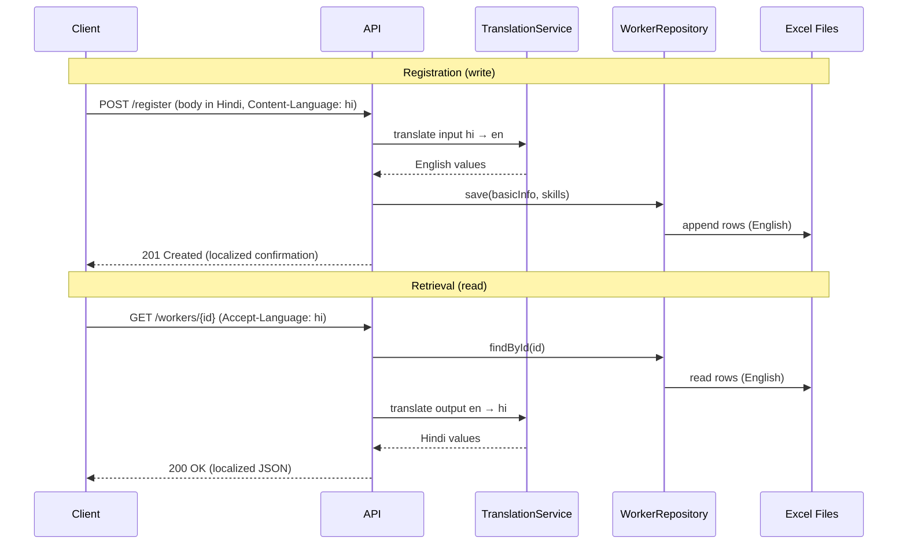

# Product Requirements — CMX Labour Registration

## Overview

CMX Labour Registration is a Spring Boot API that lets workers register themselves in the CMX Labour Registry. Each worker submits **basic profile information** and a **skills profile** in a single registration flow. Data is persisted in Excel workbooks (standing in for a database) with a repository abstraction so SQL can replace Excel later without changing business logic or API contracts.

Authentication is **not required** in v0.1.

## Goals

- Allow a worker to self-register with contact details, location, and skills.
- Persist all records in English as the canonical language.
- Return data to the client in the worker’s preferred language (multi-language read path).
- Keep storage swappable (Excel now, relational DB later) via a repository abstraction layer.

## Non-Goals (v0.1)

- Authentication and authorization.
- Admin portal or web UI (API-only).
- File upload for photos/portfolio (URLs only).
- PostgreSQL or any SQL database (deferred; abstraction prepared).
- Search, filtering, or listing all workers (post-MVP).
- Assignment, payroll, or contractor workflows.

## Persona

| Persona | Needs |
|---------|-------|
| **Worker (Labour)** | Register basic info and skills in their preferred language; receive confirmation and view profile in that language. |

## Data Model — Two Tables (Excel Workbooks)

Records are linked by **`id`** (basic info) and **`user_id`** (skills). `user_id` in the skills workbook equals `id` in the basic-info workbook.

### Table 1: Worker Basic Info (`workers_basic_info.xlsx`)

| Field | Type | Required | Notes |
|-------|------|----------|-------|
| `id` | string (UUID) | auto | Primary key; generated on registration |
| `full_name` | string | yes | Stored in English |
| `mobile_number` | string | yes | Unique |
| `email` | string | yes | Unique |
| `profile_photo_url` | string | no | URL reference only |
| `date_of_birth` | date (ISO-8601) | yes | |
| `age` | integer | derived | Computed from `date_of_birth`; not persisted |
| `gender` | enum | yes | Canonical English value, e.g. `MALE`, `FEMALE`, `OTHER` |
| `city` | string | yes | Stored in English |
| `state` | string | yes | Stored in English |
| `address` | string | yes | Stored in English |
| `pincode` | string | yes | |
| `latitude` | decimal | no | |
| `longitude` | decimal | no | |
| `primary_language` | string | yes | BCP-47 code, e.g. `en`, `hi`, `ta` — worker’s preferred display language |
| `availability_status` | enum | yes | e.g. `AVAILABLE`, `UNAVAILABLE`, `ON_ASSIGNMENT` |
| `created_at` | datetime | auto | Set on create |
| `updated_at` | datetime | auto | Set on create/update |

### Table 2: Worker Skills (`workers_skills.xlsx`)

| Field | Type | Required | Notes |
|-------|------|----------|-------|
| `user_id` | string (UUID) | yes | FK → `workers_basic_info.id` |
| `primary_skill` | string | yes | Stored in English |
| `secondary_skills` | list of strings | no | Pipe-separated (`\|`) in Excel |
| `experience_years` | decimal | yes | |
| `skill_level` | enum | yes | e.g. `BEGINNER`, `INTERMEDIATE`, `EXPERT` |
| `certifications` | list of strings | no | Pipe-separated in Excel |
| `tools_owned` | list of strings | no | Pipe-separated in Excel |
| `work_type` | enum | yes | e.g. `FULL_TIME`, `PART_TIME`, `CONTRACT` |
| `languages_spoken` | list of strings | no | BCP-47 codes; pipe-separated in Excel |
| `portfolio_images` | list of strings | no | URLs; pipe-separated in Excel |

## Functional Requirements

### FR-1 Worker Registration

- Expose `POST /api/v1/workers/register` accepting basic info and skills in one request body.
- Generate a unique `id` (UUID) for the worker.
- Validate required fields and formats (email, mobile, pincode, date of birth, enums).
- Reject duplicate `mobile_number` or `email`.
- Persist basic info to `workers_basic_info.xlsx` and skills to `workers_skills.xlsx` in the same operation; roll back skills write if basic info write fails (best-effort for Excel; full transactional semantics when SQL replaces Excel).
- Accept an optional `Accept-Language` or `Content-Language` header on input: if the worker submits in a non-English language, translate field values to English before saving.

### FR-2 Worker Retrieval

- Expose `GET /api/v1/workers/{id}` returning basic info + skills combined.
- Honor `Accept-Language` header (fallback: worker’s `primary_language`, then `en`).
- Translate stored English values to the requested language before returning the response.
- `age` is computed at read time from `date_of_birth`.

### FR-3 Multi-Language Support

- **Write path:** all persisted values in Excel are English (canonical).
- **Read path:** API responses localized to the requested language.
- **Static labels** (field names, enum display labels, validation messages): Spring `MessageSource` with `messages_en.properties`, `messages_hi.properties`, etc.
- **Dynamic content** (skills, city, address, certifications): `TranslationService` abstraction; v1 uses bundled translation maps / reference tables; external translation API can be plugged in later.
- Names (`full_name`) are generally not translated; returned as stored unless transliteration is configured.

### FR-4 Storage Abstraction

- Business logic depends only on repository interfaces, not Excel or SQL.
- v0.1 implementation: Apache POI reading/writing `.xlsx` files.
- Future implementation: JPA + PostgreSQL implementing the same interfaces.
- Switch storage backend via Spring profile or `cmx.storage.type=excel|sql` property.

### FR-5 Cross-Cutting Concerns

- **Exception handling:** single `@RestControllerAdvice` maps all application and validation errors to a consistent JSON error envelope.
- **Logging:** centralized request/response and error logging (filter or aspect); correlation ID on every request; no PII in log messages (mask mobile/email).

## Non-Functional Requirements

| ID | Requirement |
|----|-------------|
| NFR-1 | Java 17 runtime. |
| NFR-2 | Spring Boot 3.x (compatible with Java 17). |
| NFR-3 | OpenAPI 3 spec for registration and get-worker endpoints. |
| NFR-4 | Excel files stored under configurable directory (`cmx.storage.excel.base-path`). |
| NFR-5 | API error responses include `code`, `message`, `correlationId`, and optional `fieldErrors`. |
| NFR-6 | No authentication in v0.1; design API so auth can be added without breaking contracts. |

## API Summary (v0.1)

| Method | Path | Description |
|--------|------|-------------|
| `POST` | `/api/v1/workers/register` | Register worker (basic info + skills) |
| `GET` | `/api/v1/workers/{id}` | Get worker by ID (localized response) |
| `GET` | `/api/v1/health` | Health check |

## Multi-Language Flow

## Assumptions

- Excel files are created on first startup if missing (header row + empty data).
- List fields use pipe (`|`) as delimiter in Excel cells.
- Enum values are stored as uppercase English codes; display labels come from i18n bundles.
- Single-instance deployment for v0.1 (file-based storage is not suited for concurrent multi-node writes without external locking).

## Open Questions

1. Which languages must be supported at launch (e.g. `en`, `hi`, `ta`, `te`)?
2. Should duplicate mobile/email checks be case-insensitive for email?
3. Is a two-step registration (basic info first, skills later) needed, or is single-shot registration sufficient?

## Release Scope — MVP (v0.1)

**In scope**

- Repository abstraction + Excel implementation
- Worker registration API (basic info + skills)
- Worker get-by-id API with localization
- Centralized exception handling and logging
- OpenAPI documentation
- Java 17, Spring Boot 3.x, no authentication

**Out of scope**

- SQL database, auth, search/list, update/delete, file uploads
